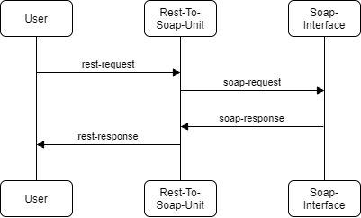

# rest-to-soap-unit

a simple python/flask rest api hosted on nginx unit for proxying/transforming a rest request to an internal soap interface  




# Building

adjust the url of the wsdl file in the Dockerfile (or later using the environment variable SOAP_URL):
```
SOAP_URL=http://www.thomas-bayer.com/axis2/services/BLZService?wsdl
```
Next build the docker image:
```
docker build -t rest-to-soap-unit .
```

# Usage
To run the docker container:
```
docker run --name rest-to-soap-unit -d -p 127.0.0.1:8080:8000 rest-to-soap-unit
```
To use the app, execute a rest request to the mapped port 8080 on localhost:
e.g. when using the default wsdl (public soap service for getting details about a german bank by providing the bank code or blz):

```
curl -X POST -d "50010060" http://localhost:8080/api/getBank
```

the result should be:

```
{
    "bezeichnung": "Postbank",
    "bic": "PBNKDEFFXXX",
    "ort": "Frankfurt am Main",
    "plz": "60288"
}
```

# Usage in docker-compose:

```
version: '3'
services:
  rest-to-soap-unit:
    build: .
    image: rest-to-soap-unit:latest
    ports:
      - "127.0.0.1:8080:8000"  # Map port 8000 of docker container to 8080 on localhost
    environment:
      - SOAP_URL=http://www.thomas-bayer.com/axis2/services/BLZService?wsdl
```

# Swagger-UI
The swagger-ui can be accessed on the /doc endpoint
so e.g. open http://127.0.0.1:8080/doc in the browser and the swagger-ui will open

# Swagger-Configuration file
The swagger-/openapi-configuration file can be retrieved on the /help endpoint
so e.g. open http://127.0.0.1:8080/help in the browser and the swagger-configuration file will load